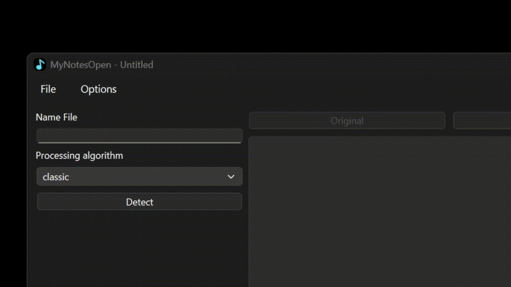

# -QT-musical-note-recognition-application
 This project solves the problem of identifying musical notes from photos and playing them back.
 The project is written in Python using the PyQt, OpenCV, and Numpy libraries.The pydub and FluidSynth libraries were used to play the notes and convert them into audio format.

# The operation of the application and its structure
 The application consists of several pages. The main page where you can upload a photo, a project and start the algorithm. The page of importing a project to audio where you can import a project to Mp3, Wav, Midi. The options page where you can customize the algorithm for yourself and edit the application data.
 # The main page
  
  By clicking on the file menu and selecting Open -> New image, you can select a photo in the .jpg and .png format in the file explorer.
